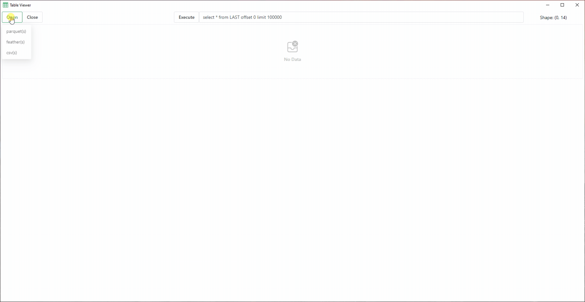

# TableViewer

A cross-platform Table Viewer (based on tauri) with `sql` query support.

Supported file formats:
- `*parquet` file(s)
- feather file(s)(`*.ipc`, `*.arrow`, `*.feather`)
- `*.csv` file(s)

Platform support:
- Windows: download from [releases](https://github.com/GreyRaphael/TableViewer/releases)
- Linux: built by yourself, `cargo tauri build`
- MacOS: built by yourself, `cargo tauri build`